# Enrollment: flows and entry points

This document describes **how a visitor reaches enrollment** and **which steps they see**, based on program content (`src/content/programas/*.md`) and shared libraries.

## Diagram index (visual reference)

| # | Diagram | Section |
|---|---------|---------|
| A | Ficha → inline vs application (overview) | [§2](#2-which-flow-runs-enrollmentflow) |
| B | `getEnrollmentFlow` decision tree (nivel + override) | [§2.1](#21-detailed-decision-tree-getenrollmentflow) |
| C | Site entry routes (listing → ficha → wizard / pago) | [§3](#3-entry-points-user-journeys) |
| D | System context: pages ↔ APIs | [§3.1](#31-system-context-pages-and-apis) |
| E | Inline CE: step state machine + footer | [§4](#4-flow-a--inline-educación-continua-continuouseducationform) |
| F | Inline CE: payment branch (Stripe vs wire) | [§4.1](#41-inline-flow-payment-branch) |
| G | Inline CE: sequence (APIs) | [§4](#4-flow-a--inline-educación-continua-continuouseducationform) |
| H | Application wizard: step graph | [§5](#5-flow-b--application--admisión-enrollmentslug) |
| I | Application: nivel → which blocks | [§5.1](#51-application-nivel--wizard-blocks) |
| J | Stripe Checkout → return | [§7.1](#71-stripe-checkout-return-happy-path) |
| K | Content: `variantOptions` | [§6](#6-optional-program-variants-módulos--fechas) |

---

## 1. Canonical program URL

Every programa has a detail page:

| Route | Builder |
|-------|---------|
| `/oferta-academica/{slug}` | `src/pages/oferta-academica/[slug].astro` |

`{slug}` comes from Astro’s entry slug: **`slug:` in YAML frontmatter overrides the filename**. Always use `getProgramPathSlug(program)` from `src/lib/programPaths.ts` in code; do not assume slug equals file name.

Listing hubs (examples): `/oferta-academica`, category pages under that tree (see `src/pages/oferta-academica.astro` and related routes).

---

## 2. Which flow runs? (`enrollmentFlow`)

Resolution is implemented in `src/lib/enrollmentRouting.ts`:

```text
IF program.data.enrollmentFlow is set
  → use it ("inline" | "application")
ELSE IF program.data.nivel ∈ { maestria, doctorado, especialidad }
  → "application"
ELSE
  → "inline"
```

`nivel` is one of: `curso`, `taller`, `diplomado`, `maestria`, `doctorado`, `especialidad` (`src/lib/programNiveles.ts`, mirrored in `src/content.config.ts`).

**Override example:** a `taller` can set `enrollmentFlow: application` in frontmatter to force the long wizard on `/enrollment/{slug}` instead of the inline form on the ficha.

### Overview (ficha)

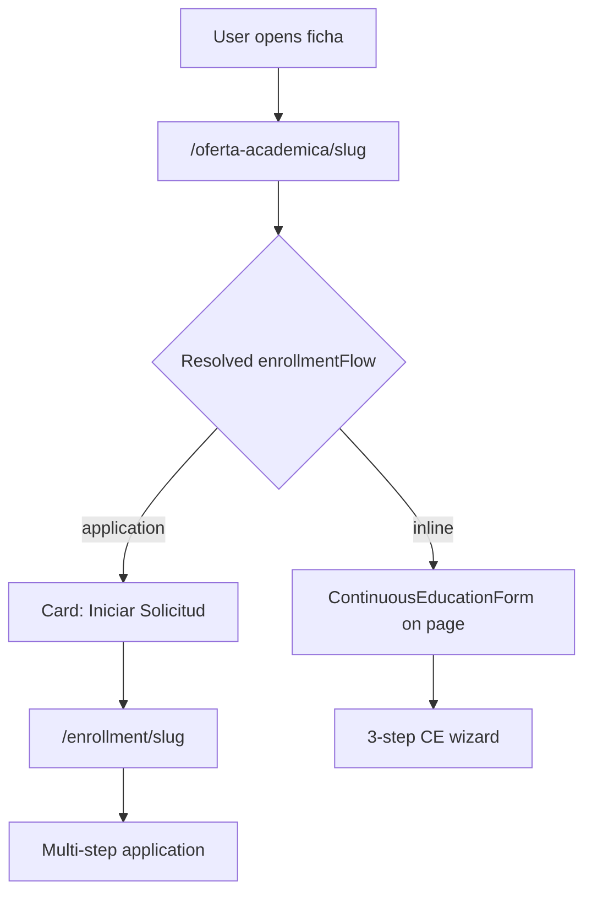

### 2.1 Detailed decision tree (`getEnrollmentFlow`)

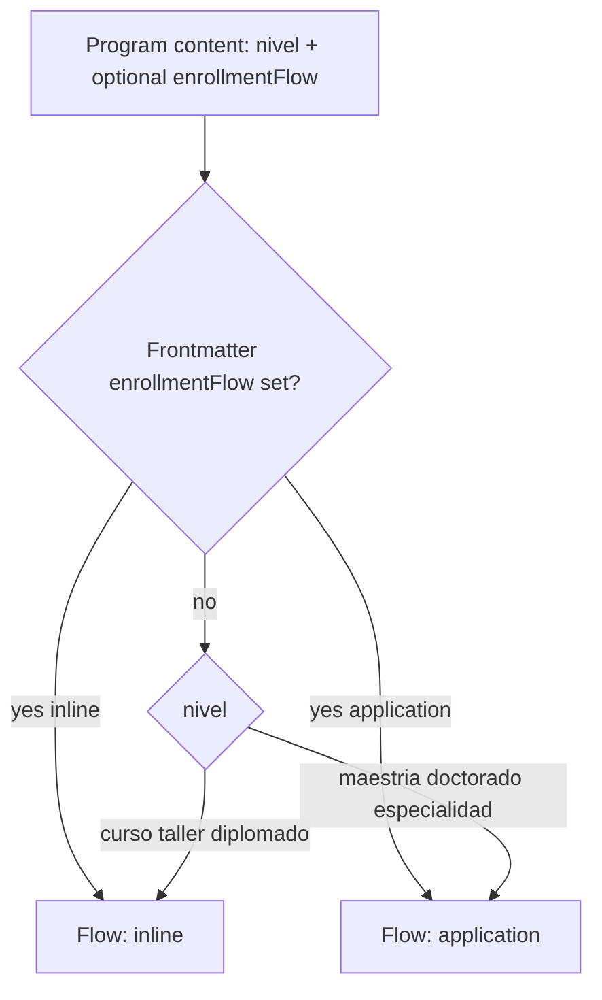

### Default matrix (sin override en frontmatter)

| `nivel` | Flow |
|---------|------|
| `curso` | inline |
| `taller` | inline |
| `diplomado` | inline |
| `maestria` | application |
| `doctorado` | application |
| `especialidad` | application |

---

## 3. Entry points (user journeys)

These are the main **technical** entry surfaces (not an exhaustive marketing list):

| Entry | Typical path |
|-------|----------------|
| Program ficha | `/oferta-academica/{slug}` — always; bottom section switches by flow |
| Application wizard | `/enrollment/{slug}` — **only built for** `getEnrollmentFlow(program) === "application"` (`getStaticPaths` in `src/pages/enrollment/[slug].astro`) |
| After Stripe Checkout | `/pago-exitoso` (and Stripe redirect URLs configured in `src/pages/api/stripe/create-checkout-session.ts`) |
| Legacy / ancillary pages | e.g. `admisiones.astro`, `inscripciones.astro`, `contacto.astro`, `educacion-continua-inscripciones.astro` — link into the same routes above |

### Route map

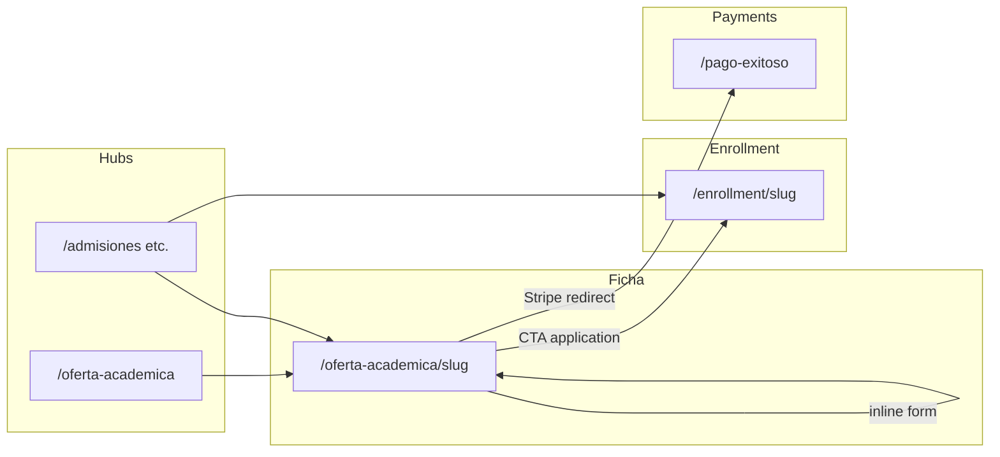

### 3.1 System context (pages and APIs)

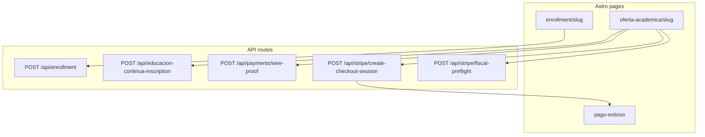

---

## 4. Flow A — Inline educación continua (`ContinuousEducationForm`)

**Where:** bottom of `src/pages/oferta-academica/[slug].astro` when `enrollmentFlow === "inline"` (renders `ContinuousEducationForm` with `embedInAsideCard={false}`).

**Steps (fixed, 3):** implemented in `src/components/forms/ContinuousEducationForm.astro`

| Step | ID | Purpose |
|------|-----|---------|
| 1 | `#step-1` | Datos del participante, modalidad, consentimientos |
| 2 | `#step-2` | Método de pago (Stripe vs transferencia), facturación opcional |
| 3 | `#step-3` | Declaración y envío |

Footer actions (`#next-btn`, `#prev-btn`, `#submit-btn`) are **siblings** of each `.step-section` inside the `<form>` — they must not be nested inside a hidden step section or they disappear on paso 1.

### CE step state (user navigation)

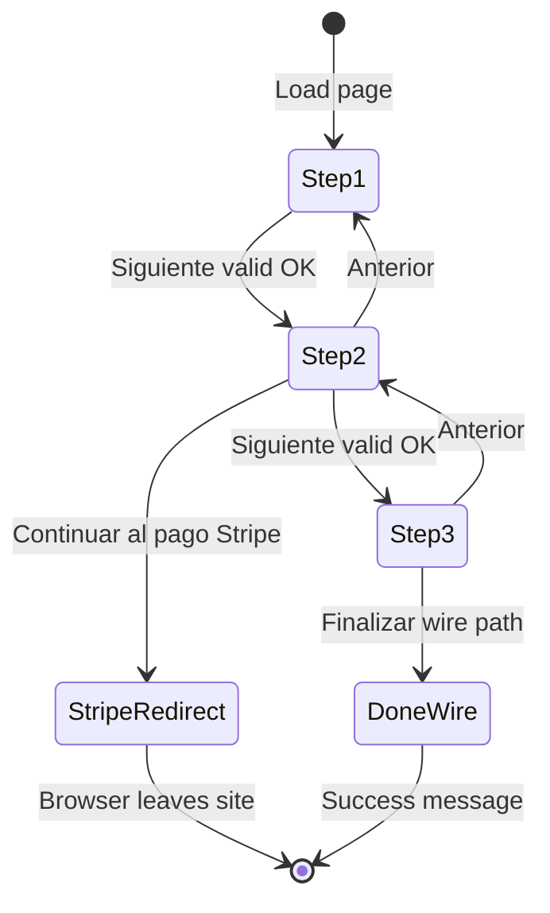

### Sequence (APIs)

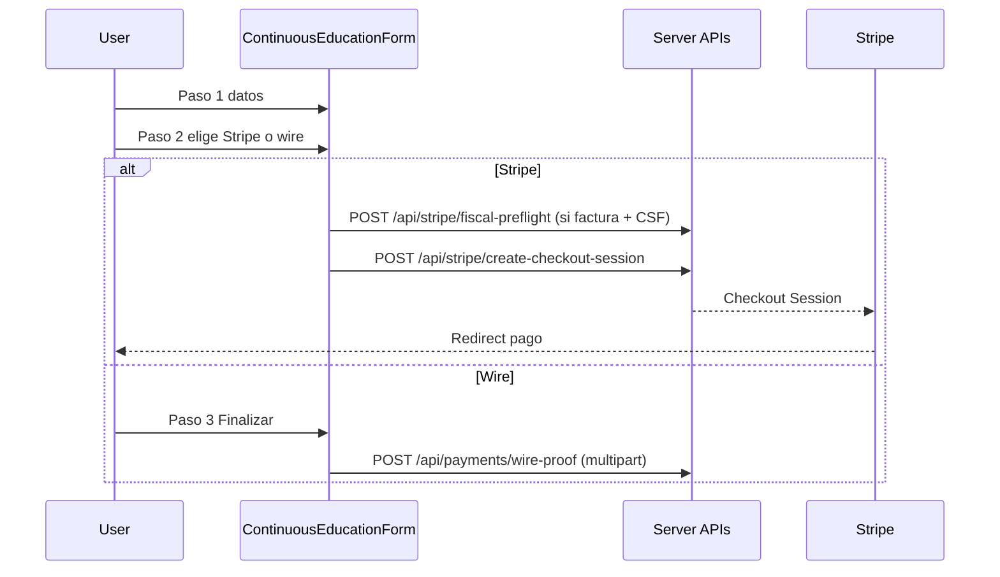

### 4.1 Inline flow: payment branch

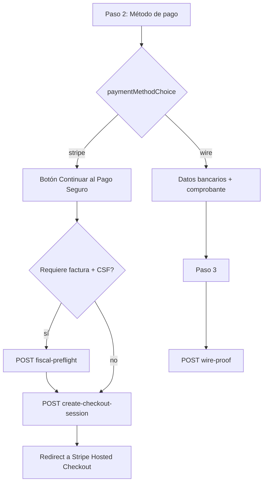

**Relevant endpoints:**

| Client action | Endpoint |
|---------------|----------|
| CSF preflight before Stripe | `POST /api/stripe/fiscal-preflight` |
| Checkout | `POST /api/stripe/create-checkout-session` |
| Wire + comprobante | `POST /api/payments/wire-proof` |
| Non-wire legacy path in form script | `POST /api/educacion-continua-inscription` (see form submit branch for `paymentMethod`) |

---

## 5. Flow B — Application / admisión (`/enrollment/[slug]`)

**Where:** `src/pages/enrollment/[slug].astro` — **only generated for application programs**.

**Step list is data-driven** (see `<script>` `stepEntries`): optional variant step, personal info, optional extended profile blocks, optional academic degrees, documents, then submit. The exact list depends on:

| Input | Source | Effect |
|-------|--------|--------|
| `variantOptions` in frontmatter | `getVariantOptions()` in `src/lib/programVariants.ts` | Prepends `step-variant` when modules and/or dates are configured |
| `nivel` | `requiresExtendedApplicantProfile()` in `src/lib/enrollmentAdmissionFlags.ts` | Maestría, doctorado, especialidad: extra personal/address/emergency/health sections |
| `nivel` | `requiresAcademicDegreeSteps()` | **Taller** skips degree steps; other niveles include academic formation where applicable |
| Doctorado cédula rules | `src/lib/validation/enrollmentText.ts` (used by API) | Server-side validation complements the wizard |

After submit, the page can show **post-submit** UI (payment choice, wire upload, etc.) — see IDs such as `post-submit-panel` in the same file.

**Primary API:**

| Action | Endpoint |
|--------|----------|
| Submit application (multipart) | `POST /api/enrollment` — `src/pages/api/enrollment.ts` (`prerender = false`) |

### Application step graph (logical order)

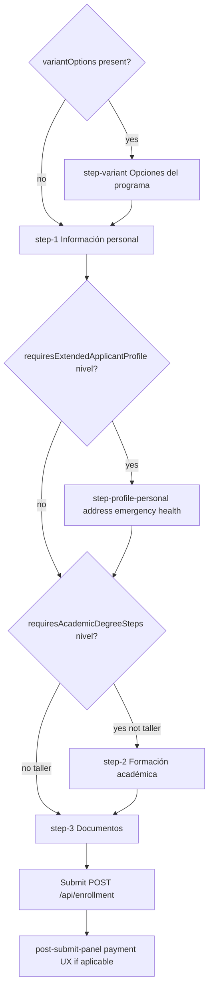

### 5.1 Application: `nivel` → wizard blocks

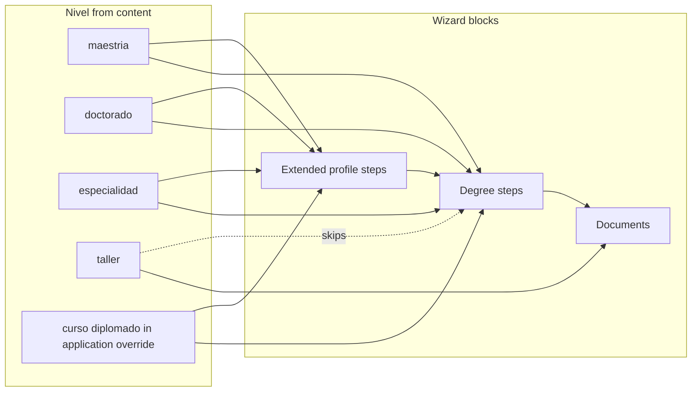

---

## 6. Optional program variants (módulos / fechas)

Programs may define `variantOptions` in `src/content.config.ts` / frontmatter:

- **`moduleSelection`**: user picks a module/package; options may carry **per-modality Stripe price IDs**.
- **`dateSelection`**: user picks cohort / start date (metadata for the application).

Used by:

- `src/pages/enrollment/[slug].astro` — optional first step + client data attributes.
- `src/pages/oferta-academica/[slug].astro` — copy when `variantModuleOptions` exist (e.g. “elige módulo durante la inscripción”).

### Variant step (application)

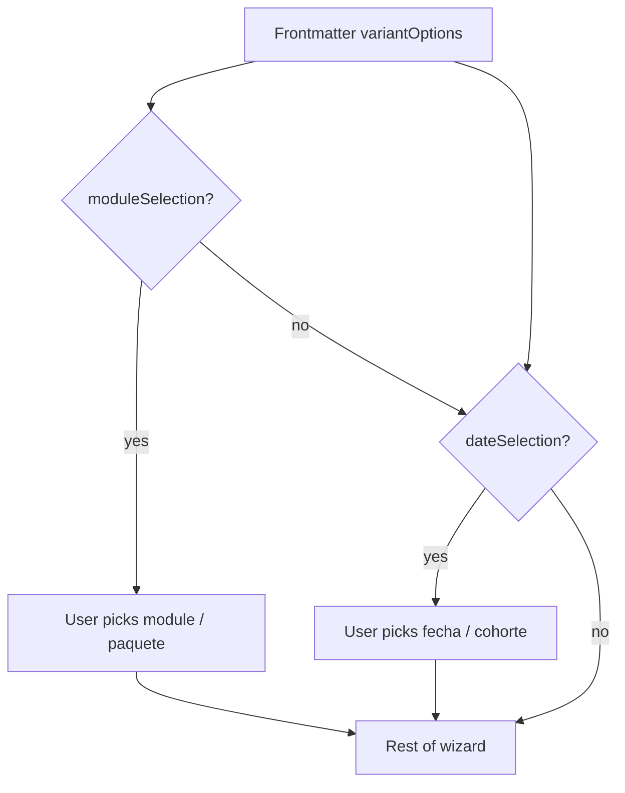

---

## 7. Payments and Stripe

| Concern | Location |
|---------|----------|
| Allowed price ID shape / “has checkout” helper | `src/lib/stripeAllowedPrices.ts` |
| Create Checkout Session | `src/pages/api/stripe/create-checkout-session.ts` |
| Success page | `src/pages/pago-exitoso.astro` |

### 7.1 Stripe Checkout return (happy path)

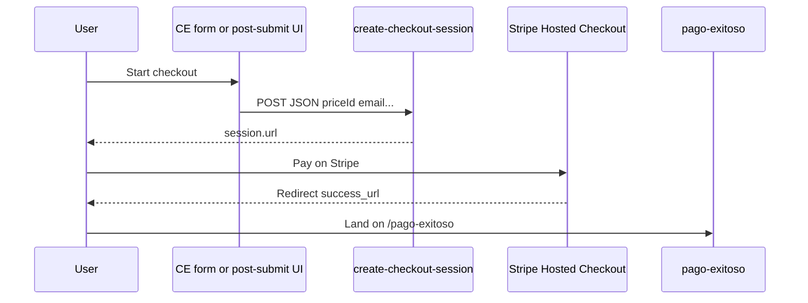

---

## 8. Layout / UX pitfalls (for maintainers)

- **Do not** put `data-animate="fade-up"` on a wrapper that contains `position: fixed` descendants — CSS `transform` on ancestors breaks fixed positioning (`src/pages/oferta-academica/[slug].astro` enrollment section intentionally avoids this).
- **WhatsApp float** (`src/components/integrations/WhatsAppButton.astro`): keep `z-index` below modals/header as documented in that file so it does not cover primary CTAs.
- **ContinuousEducationForm HTML:** each `.step-section` must be **properly closed** before the next section or the footer; otherwise the footer ends up inside a hidden step (see historical bug: footer nested under `#step-2`).

---

## 9. Related content authoring

- Template: `src/content-templates/programas/TEMPLATE.md`
- Schema reference: `src/content.config.ts` (`programas` collection)

When adding a new programa, set **`slug`**, **`nivel`**, and optionally **`enrollmentFlow`**, **`stripePriceIds`**, **`variantOptions`**, **`registroAcademico`**, etc., then verify both the ficha and (if application) `/enrollment/{slug}` build in `npm run build`.

---

## Rendering Mermaid in your editor

- **GitHub / GitLab**: Mermaid often renders in Markdown preview for `.md` files.
- **VS Code / Cursor**: use a Mermaid preview extension if the built-in preview shows code fences only.
- **Export**: paste diagrams into [Mermaid Live Editor](https://mermaid.live) for PNG/SVG.
